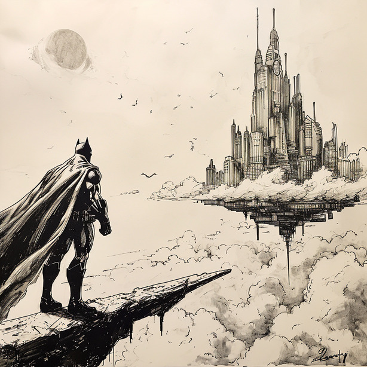

# 蝙蝠侠与超人：天空之城的秘密

在哥谭市的宁静夜晚，蝙蝠侠正在巡逻时突然接到了超人的求助信号。超人告诉他，一个神秘的天空之城出现在云层之上，里面隐藏着能够控制天气的强大装置。

蝙蝠侠和超人决定联手调查。他们乘坐蝙蝠飞行器穿越云层，发现了这座悬浮的奇异城市。但是，他们很快就发现了问题——这座城市被恶名昭彰的莱克斯·卢瑟控制着，他计划用控制天气的装置来威胁全世界。

英雄们必须小心应对。蝙蝠侠利用他的技术和智慧，超人则利用他的力量和速度。他们悄悄潜入控制中心，与卢瑟的手下展开了激烈的战斗。

在一番艰苦的斗争后，蝙蝠侠和超人成功地关闭了控制天气的装置，并捉住了卢瑟。他们把危险的装置带回地面，交给了可以信赖的科学家们。

随着天空之城的秘密被揭露，哥谭市和整个世界再次恢复了平静。蝙蝠侠和超人再次证明了，无论面对多大的挑战，他们总是可以相互依靠，守护正义。
