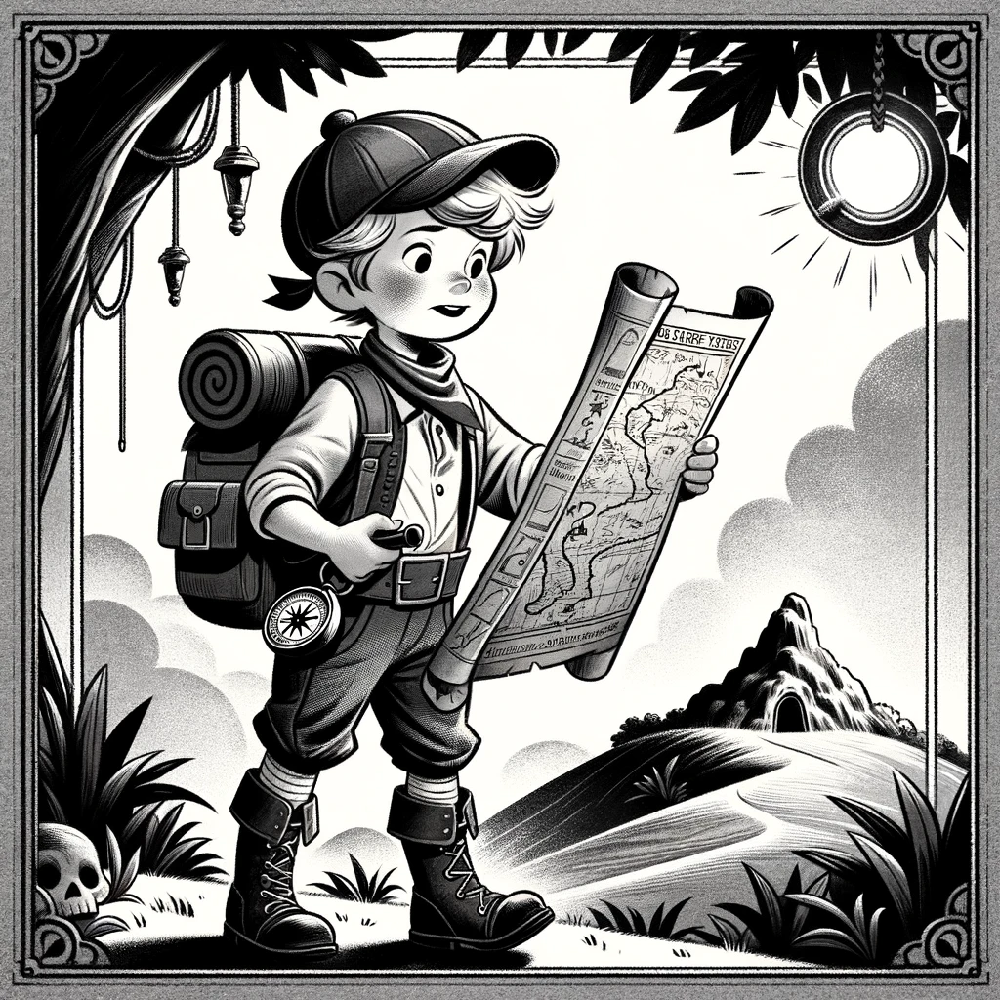

# 登山小英雄的宝藏图

在一个风和日丽的早晨，小明穿上了他最喜欢的鞋，戴上一顶新买的帽子，准备去附近的小山上冒险寻宝。他的口袋里装着一张祖父留给他的古老图片，上面画有一个藏宝的秘密位置。他还带上了一个壶，里面装满了清凉的山泉水。

小明查看了一下手表，指针指向了出发的时间。他迅速穿上了他的冒险裤，每个口袋里都装满了必需的小工具。

就在他准备出发的时候，他注意到他的鞋带松了，于是他赶紧登上小凳子，系紧了鞋带。现在，一切准备就绪，小明开始了他的登山之旅。

小明跟着古老的图，走过了小溪，穿过了树林，最后来到了一个隐藏的山洞。他找到了一个套着锁链的宝箱，但它被锁上了。小明用手中的指南针，对准了图上的方向，发现指南针上的针也是一个钥匙！

他用这个针钥匙打开了宝箱，里面装满了金币和宝石。小明开心地跳了起来，他的第一次冒险就这样成功了！

---

园地-01
套帽登鞋裤图壶指针
